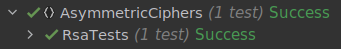

# Asymmetric cyphers

### Course: Cryptography & Security
### Author: Cernei Andrei

----
## Objectives:
 * Get familiar with the asymmetric cryptography mechanisms.

 * Implement an example of an asymmetric cypher.


## Implementation description
* ### RSA

The RSA algorithm is an asymmetric cryptography algorithm. Asymmetric actually means that it works on two different keys i.e. public key and private key.

The RSA algorithm involves three steps: key generation, encryption, and decryption.

1. Key generation

The keys for the RSA algorithm are generated in the following way:

Choose two large prime numbers p and q.
```
var cipher = new Rsa(547, 659);
```
Calculate n = pq

Calculate the totient function $\phi$(n) = (p − 1)(q − 1).

Select an integer e, such that e is co-prime to $\phi$(n) and 1 < e < $\phi$(n).
The pair of numbers (n, e) makes up the public key.

Determine d as d $\equiv$ $e^{-1}$ mod $\phi$(n);

d can be found using the extended euclidean algorithm. The pair (n, d) makes up the private key.

```
private static (BigInteger, BigInteger, BigInteger) GenerateKeyPair(BigInteger p, BigInteger q)
{
    var n = p * q;
    var phi = (p - 1) * (q - 1);
    var e = 2;
    for (; e < phi; e++)
    {
        if (BigInteger.GreatestCommonDivisor(e, phi) == 1)
            break;
    }

    var d = AdvancedMath.ModularInverse(e, phi);
    return (e, d, n);
}
```

2. Encryption

In order to encrypt the message the formula with the public key is used 
c $\equiv$ $m ^ e$ mod n.

```
public List<BigInteger> Encrypt(string message)
{
    var encryptedMessage = new List<BigInteger>();
    foreach (var letter in message)
    {
        var asciiValue = (int)letter;
        var encryptedLetter = (BigInteger)Math.Pow(asciiValue, (double)this.publicKey) % this.n;
        encryptedMessage.Add(encryptedLetter);
    }

    return encryptedMessage;
}
```
The decryption procces is similar, but the private key is used instead, m $\equiv$ $c^d$ mod n.
```
public string Decrypt(List<BigInteger> encryptedMessage)
{
    var decryptedMessage = new List<char>();
    foreach (var encryptedLetter in encryptedMessage)
    {
        var asciiValue = BigInteger.Pow(encryptedLetter, (int)this.privateKey) % this.n;
        var decryptedLetter = (char)asciiValue;
        decryptedMessage.Add(decryptedLetter);
    }

    return string.Join("", decryptedMessage);
}
```

## Results

To demonstrate the implementation a test was created:
```
public class RsaTests
{
    [Test]
    public void EncryptThenDecryptShouldReturnCorrectMessage()
    {
        var cipher = new Rsa(547, 659);
        var message = "secret";

        var encryptedMsg = cipher.Encrypt(message);
        var decryptedMsg = cipher.Decrypt(encryptedMsg);

        decryptedMsg.Should().Be(message);
    }
}
```
The results were as follows:




## Conclusion

In this laboratory work I got familiar with asymmetric cyphers. I implemented a chypher based on RSA.

For proof to show that it works were implemented unit tests.

