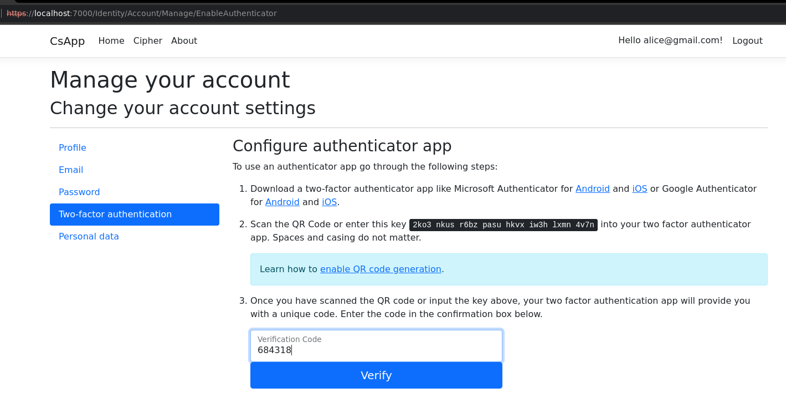
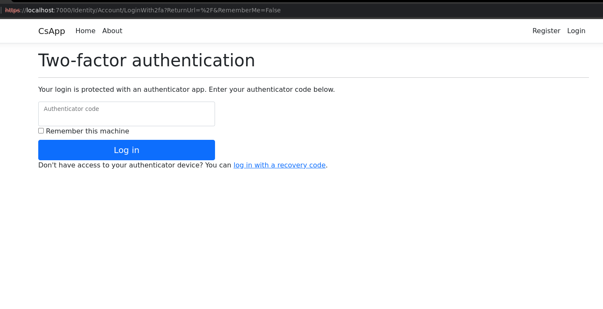
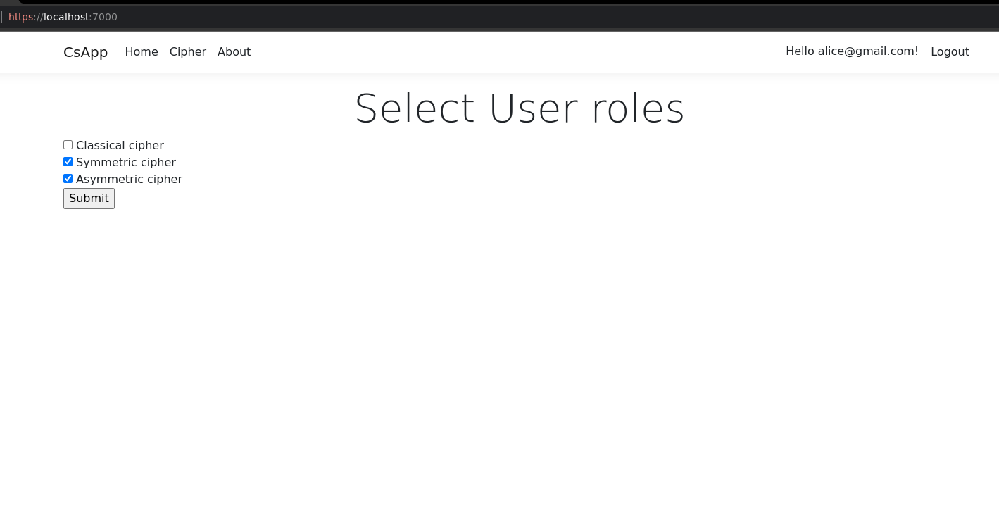
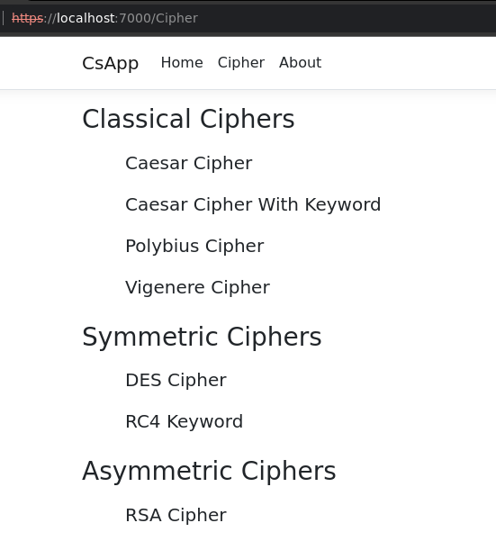
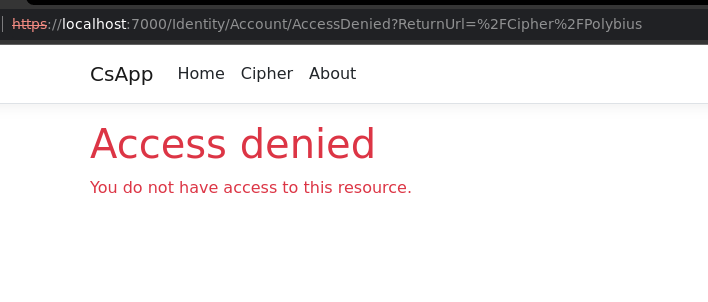
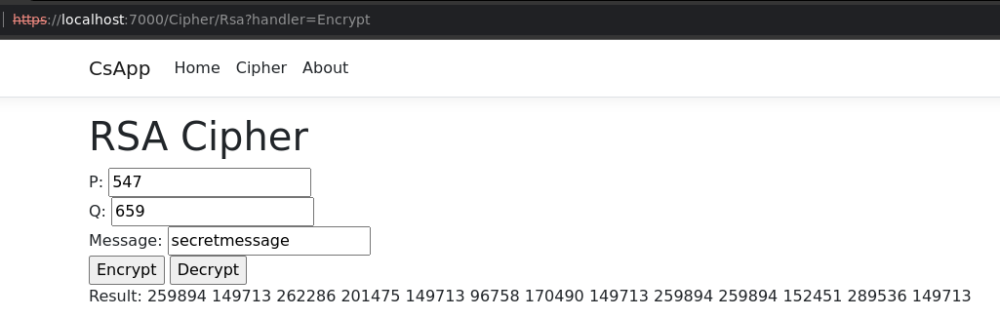

# Web Authentication & Authorization.

### Course: Cryptography & Security
### Author: Cernei Andrei
----

## Objectives:
1. Take what you have at the moment from previous laboratory works and put it in a web service / serveral web services.

2. Your services should have implemented basic authentication and MFA (the authentication factors of your choice).

3. Your web app needs to simulate user authorization and the way you authorise user is also a choice that needs to be done by you.

4. As services that your application could provide, you could use the classical ciphers. Basically the user would like to get access and use the classical ciphers, but they need to authenticate and be authorized. 

## Implementation description
Create an ASP.NET Core Web Application project with Individual User Accounts.

In the Authentication type input, select Individual User Accounts.

The generated project provides ASP.NET Core Identity as a Razor Class Library.

ASP.NET Core Identity:

* Is an API that supports user interface (UI) login functionality.
* Manages users, passwords, MFA, profile data, roles, claims, tokens, email confirmation, and more.

Identity is enabled by calling UseAuthentication. UseAuthentication adds authentication middleware to the request pipeline.  
For authorization we should use:
```
app.UseRouting();

app.UseAuthentication();
app.UseAuthorization();
``` 

Add Role services to Identity  
Append AddRoles to add Role services:

```
builder.Services.AddDefaultIdentity<IdentityUser>(options => options.SignIn.equireConfirmedAccount = true)
    .AddRoles<IdentityRole>()
    .AddEntityFrameworkStores<ApplicationDbContext>();
```
Require authenticated users  
Set the fallback authorization policy to require users to be authenticated:
```
builder.Services.AddAuthorization(options =>
{
    options.FallbackPolicy = new AuthorizationPolicyBuilder()
        .RequireAuthenticatedUser()
        .Build();
});
```
The preceding highlighted code sets the fallback authorization policy. The fallback authorization policy requires all users to be authenticated, except for Razor Pages, controllers, or action methods with an authorization attribute.

At this moment we can login/logout users, after the user is logged in he can set up Two-factor authentication app that generates a random key for the Google/Microsoft Authenticator app.



The user name and password is saved as a plain text and hash respectively in the database.
```
var connectionString = builder.Configuration.GetConnectionString("DefaultConnection");
builder.Services.AddDbContext<ApplicationDbContext>(options =>
    options.UseSqlite(connectionString));
builder.Services.AddDatabaseDeveloperPageExceptionFilter();

builder.Services.AddDefaultIdentity<IdentityUser>(options => options.SignIn.RequireConfirmedAccount = true)
    .AddRoles<IdentityRole>()
    .AddEntityFrameworkStores<ApplicationDbContext>();
```
Now everytime the user wants to login he should enter code from Authenticator app.



However if he select 'Remember this machine' checkbox he would not be asked to put the code next time when he logs in.

After the user is authenticated he can set his own authorization role.  
He should choose one or more roles between Classic Symmetric and Asymmetric role.


After the user submits his choices his roles are changed
```
var isEnabled = await this.userManager.IsInRoleAsync(user, roleName);
if (willBeEnabled && !isEnabled)
{
    await this.userManager.AddToRoleAsync(user, roleName);
    return true;
}
if (!willBeEnabled && isEnabled)
{
    await this.userManager.RemoveFromRoleAsync(user, roleName);
    return true;
}

return false;
```
Each role gives access to different set of ciphers.



For each cipher was created an aditional Razor page.  

In our case the Clasical cipher checkbox wasn't selected, as a result we does not have access to the classical ciphers.



In the example below it is represented the RSA page

RSA page consists of:
* 3 input fields: P, Q, Message; 
* 2 buttons: Encrypt, Decrypt
* Result placeholder

If we click on Encrypt, the OnPostEncrypt mrthod is called

If we click on Encrypt, the OnPostDecrypt mrthod is called

```
public IActionResult OnPostEncrypt(IFormCollection data)
{
    if (!ModelState.IsValid) return Page();

    var cipher = new RsaCipher(RsaModel.P, RsaModel.Q);
    this.Message = cipher.Encrypt(RsaModel.Message);
    return Page();
}

public IActionResult OnPostDecrypt(IFormCollection data)
{
    if (!ModelState.IsValid) return Page();

    var cipher = new RsaCipher(RsaModel.P, RsaModel.Q);
    this.Message = cipher.Decrypt(RsaModel.Message);
    return Page();
}
```


## Conclusion

In this laboratory work I got familiar with authentication and authorization concepts by creating an web application that requires two factor authetication from a user. Also each user could set up some role based authorization that restricted access to some web application pages.  
In my web application I implemented all ciphers from previous laboratory works

