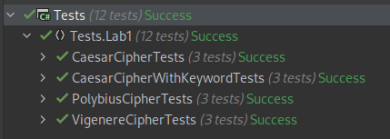

# Classical ciphers

### Course: Cryptography & Security
### Author: Cernei Ion

----
## Objectives:

* Implement dedicated functions for 4 cyphers.
* Use Solid and OOP principles to improve the code.

## Implementation description

* ### Caesar cypher

Caesar cypher is a type of substitution cipher in which each letter in the plaintext is replaced by a letter some fixed number of positions down the alphabet. To do this we encrypt each letter then create the encrypted message.

```
var letterIndex = alphabet.IndexOf(letter);
var encryptedIndex = (letterIndex + offset) % alphabet.Length;

var encryptedChar = alphabet[encryptedIndex];
```

The decryption procces is similar, we just use a negative key for the alphabet.

* ### Caesar cypher with keyword

For this cypher instead of having all letters in alphabetical order, it starts with a keyword followed by other unused letters. The obtained alphabet will be our secret alphabet. In order to avoid letter repetitions in the alphabet we combine each distinct letter from keyword with the alphabet that doesn't contain keyword letters.

```
var keywordLetters = keyword
    .ToLower()
    .Where(alphabet.Contains)
    .Distinct();
var reducedAlphabet = alphabet.Except(keywordLetters);
```

The encryption and decryption methods are the same as in Caesar cypher.

* ### Polybius cypher

For the Polybius cypher we use an alphabeth that doesnt contain 'j' letter. At the beginning of which we add a keyword and replace the 'j' letter with 'i'. Then we put it in a 5x5 matrix. In order to encrypt the message we substitute the letter with it's indices in the matrix
using the following formula

```
return $"{(letterIndex / 5) + 1}{(letterIndex % 5) + 1}";
```

In order to decrypt the message we do the opposite using the following formula.

```
var letterIndex = 5 * (x - 1) + y - 1;
return secretAlphabet[letterIndex];
```

* ### Vigenre cypher

For the Vigenre cypher encryption we use the following formula:

```
encryptedTextIndex = (messageIndex + keywordIndex) mod alphabetLength
```
for decryption we can use:

```
encryptedTextIndex = (messageIndex - keywordIndex) mod alphabetLength
```

## Results

I tested each cypher and obtained the following result:



## Conclusion

In this laboratory work were implemented 4 clasical chyphers.  
For code improvement were used OOP and SOLID principles.  
For proof to show that it works were implemented several unit tests.
