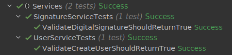

# Hash functions and Digital Signatures.

### Course: Cryptography & Security
### Author: Cernei Andrei

----
## Objectives:
1. Get familiar with the hashing techniques/algorithms.
2. Use an appropriate hashing algorithms to store passwords in a local DB.
3. Use an asymmetric cipher to implement a digital signature process for a user message.

## Implementation description
In the following implementations, for hashing message was used C# function based on sha256 algotithm.

* ### User management serivce.
For the implementation of the user management service, two functions were needed.

First create the user. This function creates a new user by adding it into a dictyonary with username as key and pasword hash as value.   

```
if (database.ContainsKey(username))
    Console.WriteLine("Username already exists");

database[username] = hash.CreateHash(password);
```
The second step is user validation. The function checks if the hash of the password input is equal to the hash of the password from the database.
```
if (database.ContainsKey(usernameInput))
    return database[usernameInput] == hash.CreateHash(passwordInput);
return false;
```

* ### Digital signature serivce.

It is important to mention that for encryption we use the private key and for decryption the public one. For this, two additional functions were added to the asymetrical cypher implemeted before.
```
var encryptedMessage = new List<BigInteger>();
foreach (var letter in message)
{
    var asciiValue = (int)letter;
    var encryptedLetter = BigInteger.Pow(asciiValue, (int)this.privateKey) % this.n;
    encryptedMessage.Add(encryptedLetter);
}

return encryptedMessage;
```
```
var decryptedMessage = new List<char>();
foreach (var encryptedLetter in encryptedMessage)
{
    var asciiValue = BigInteger.Pow(encryptedLetter, (int)this.publicKey) % this.n;
    var decryptedLetter = (char)asciiValue;
    decryptedMessage.Add(decryptedLetter);
}

return string.Join("", decryptedMessage);
```

For the implementation of the user management service, two functions were needed.

Frist, sign the message. This function creates a signature which is the hash of the message. Finally, it encrypts both the message and the signature with the [RSA cypher algorithm](../CsLabs/AsymmetricCiphers/Rsa.cs).
```
var signature = hash.CreateHash(message);
var encryptedSignature = rsa.SignEncrypt(signature);
var encryptedMessage = rsa.SignEncrypt(message);

return (encryptedMessage, encryptedSignature);
```

The second step is message validation. This function decrypts encrypted message and signature. Them it checks if the recieved signature is the same as the hash of the recieved message.
```
var receivedMessage = rsa.SignDecrypt(encryptedMessage);
var receivedSignature = rsa.SignDecrypt(encryptedSignature);

return receivedSignature == hash.CreateHash(receivedMessage);
```

## Results

To demonstrate the implementation some tests was created:

The first one tests the user validation fnction.


```
var userManager = new UserManagementService();
userManager.CreateUser("andrei", "admin");

userManager.IsValid("andrei", "admin").Should().Be(true);
```

The second one tests the digital signature validation function.

```
var messageSigner = new DigitalSignatureService();
var message = "hello";
var (signedMessage, signature) = messageSigner.Sign(message);

messageSigner.IsValid(signedMessage, signature).Should().Be(true);
```
The obtained results were as follows:



## Conclusion

In this laboratory work I got familiar with the hashing techniques, algorithms.

For code improvement were used OOP and SOLID principles.    

For proof to show that it works were implemented several unit tests.
