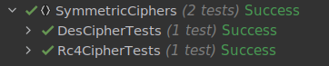

# Classical ciphers

### Course: Cryptography & Security
### Author: Cernei Andrei

----
## Objectives:

* Implement an example of a stream cipher.
* Implement an example of a block cipher.
* Use Solid and OOP principles to improve the code.

## Implementation description

* ### Stream cipher: RC4
RC4 is a stream cipher that encrypts one byte at a time.
The first step of the cipher is to initialize a 256-byte state vector S with elements from 0 to 255 (ascending). 

```
var s = new int[256];
for (var _ = 0; _ < 256; _++)
{
    s[_] = _;
}
```

Then we initialize a 256-byte state vector T with our key by repeating it if necessary untill the vector is full.

```
for (var _ = 0; _ < 256; _++)
{
    t[_] = key[_ % key.Count];
}
```

The first permutation of the vector S:

```
var j = 0;
for (var i = 0; i < 256; i++)
{
    j = (j + s[i] + t[i]) % 256;

    //  Swap the values of S[i] and S[j]
    (s[i], s[j]) = (s[j], s[i]);
}
```
Now we use the vector S in Pseudo random generation algorithm and obtain the encrypted bytes.

```
var result = new List<byte>();
var x = 0;
var y = 0;

foreach (var number in message)
{
    x = (x + 1) % 256;

    y = (y + s[x]) % 256;

    //  Swap the values of S[i] and S[j]
    (s[x], s[y]) = (s[y], s[x]);

    var k = s[(s[x] + s[y]) % 256];

    result.Add(Convert.ToByte(number ^ k));
}

return result;
```

The encryption and decryption are performed in the same way.

* ### Block cipher: DES
 DES cipher consists of some main parts: Initial Permutation, Key Generation, Rounds, SBox Substituion and Final Permutation. DES is initialized by applying initial permutation. The IP(initial permutation) takes the initial 64 bit string and replaces each bit with the one on the respective position in the IP array.

```
private static string Permute(int[] sequence, string input)
{
    var binary = StringExtensions.Hex2Binary(input);

    var permutation = "";

    foreach (var number in sequence)
    {
        permutation += binary[number - 1];
    }

    return StringExtensions.Binary2Hex(permutation);
}
```

#### The encryption process is defined by:

```
public string Encrypt(string input)
{
    // get 16 keys
    var keys = GetKeys(key);

    // initial permutation
    input = Permute(Ip, input);

    // 16 rounds
    for (var i = 0; i < 16; i++)
    {
        input = Round(input, keys[i]);
    }

    // last swap
    input = input.Substring(8, 8) + input.Substring(0, 8);

    // final permutation
    input = Permute(Ip1, input);
    return input;
}
```

The key generator creates sixteen 48-bit keys out of a 56-bit cipher key.

```
private static string[] GetKeys(string key)
{
    var keys = new string[16];

    // first key permutation
    key = Permute(Pc1, key);

    for (var i = 0; i < 16; i++)
    {
        key = ShiftLeft(key.Substring(0, 7), ShiftBits[i])
                + ShiftLeft(key.Substring(7, 7), ShiftBits[i]);

        // second key permutation
        keys[i] = Permute(Pc2, key);
    }

    return keys;
}
```
The following steps are describing the round process

```
private static string Round(string input, string key)
{
    // Dividing the input string into 2 parts
    var left = input.Substring(0, 8);
    var right = input.Substring(8, 8);

    // Expansion permutation
    var temp = Permute(Ep, right);

    // xor temp and key
    temp = StringExtensions.HexXor(temp, key);

    //  lookup in s-box table
    temp = SBoxLookup(temp);

    // Straight D-box
    temp = Permute(P, temp);

    // xor
    left = StringExtensions.HexXor(left, temp);

    return right + left;
}
```

DES uses 8 S-boxes, each with a 6-bit input and a 4-bit output. For the lookup we neet to compute the row and column. We find the row by combining first and last of the 6 bits. To find the column we combine the remaining 4 bits

```
private static string SBoxLookup(string input)
{
    var output = "";
    var binary = StringExtensions.Hex2Binary(input);
    for (var i = 0; i < 48; i += 6)
    {
        var temp = binary.Substring(i, 6);
        var num = i / 6;
        var row = Convert.ToInt32(temp[0] + "" + temp[5], 2);
        var col = Convert.ToInt32(temp.Substring(1, 4), 2);
        output += Convert.ToString(SBox[num, row, col], 16);
    }

    return output;
}
```

Lastly, we need to swap once again the right side with the left side of the 64 bit string, and perform one last permutation. ([Encryption process](#the-encryption-process-is-defined-by))

## Results

I tested each cypher and obtained the following result:



## Conclusion

In this laboratory work were implemented 2 symmetric chyphers:

* [Stream cipher: RC4](#stream-cipher-rc4)
* [Block cipher: DES](#block-cipher-des)

For proof to show that it works were implemented unit tests.
